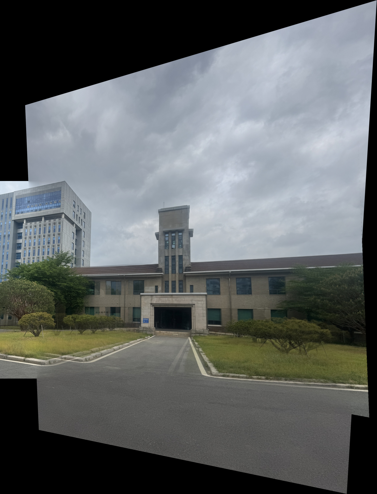
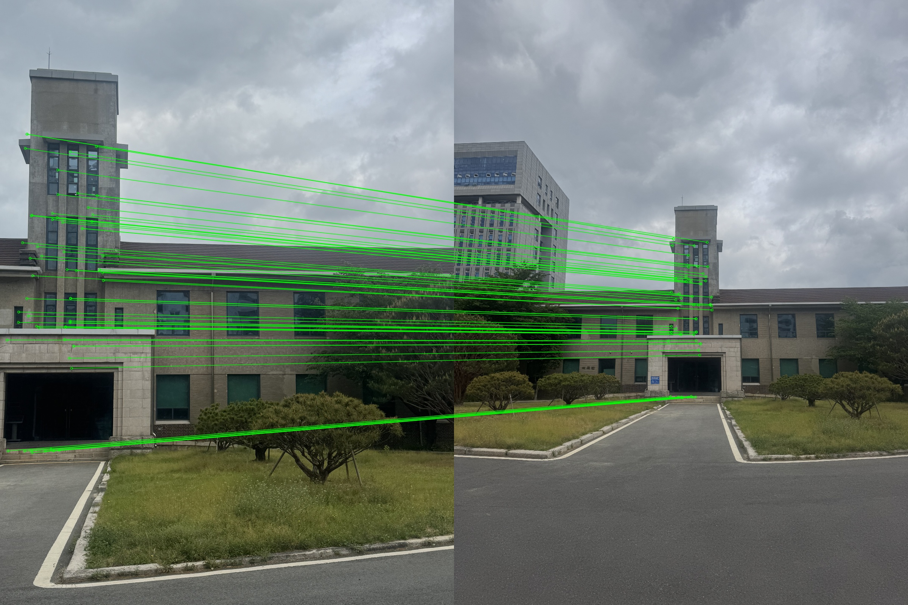
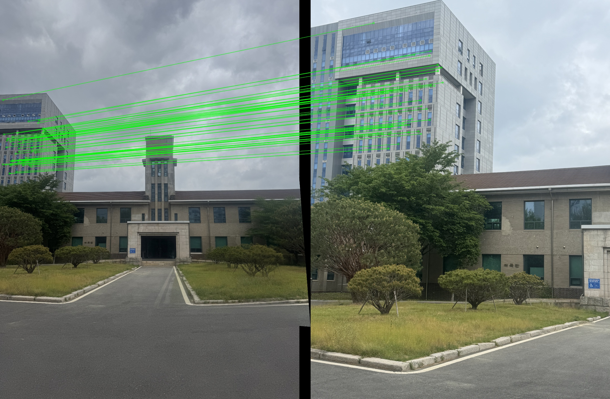

# stitcampus

Automatic panorama image stitching using SIFT feature matching and Feathering Blend with OpenCV

---

## Overview

Three overlapping images taken on campus are automatically stitched into a single wide panorama image.  
All key components — feature detection, matching, homography estimation, and blending — are implemented from scratch without using high-level APIs such as `cv2.Stitcher`.

---

## Features

### Core (Required)
- **SIFT** feature detection and description
- **FLANN** based feature matching with **Lowe's ratio test** (ratio = 0.80)
- **RANSAC** based homography estimation
- **warpPerspective** for image warping
- Automatic canvas size calculation to prevent image clipping
- Black border cropping after stitching

### Linear Feathering Blend
Instead of simple image overlay, this program applies **Feathering Blend** using distance transform to create smooth transitions at image boundaries.

- Compute a valid pixel mask for each image
- Apply `cv2.distanceTransform` to generate a smooth alpha map
- Blend overlapping regions using weighted average based on distance from boundary
- Non-overlapping regions are filled directly from each image

This eliminates hard seams and produces a natural-looking panorama.

---

## Input Images

Three photos taken on campus (SEOULTECH), capturing the same building from slightly different angles with overlapping regions.

| Image 1 | Image 2 | Image 3 |
|---------|---------|---------|
| Tower close-up (left) | Building front (center) | Building right wing |

---

## Result



**Output size:** 3052 x 4001 px
**Inliers:** 108 (image 1↔2) / 107 (image 2↔3)

### Feature Matching Visualization

| Match 1↔2 | Match 2↔3 |
|-----------|-----------|
|  |  |

---

## How to Run

### Requirements
```bash
pip install opencv-python numpy
```

### Run
```bash
python image_stitching.py
```

### Output
```
output/
├── panorama_final.jpg   # Final panorama
├── match_1.jpg          # Feature matching visualization (image 1↔2)
├── match_2.jpg          # Feature matching visualization (image 2↔3)
├── step_1.jpg           # Intermediate result after step 1
└── step_2.jpg           # Intermediate result after step 2
```
---

## Environment

- Python 3.x
- OpenCV 4.x
- NumPy
